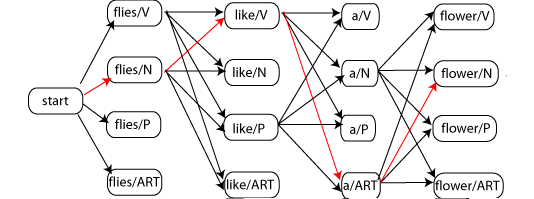

### Aim

The aim of this experiment is to understand and apply the Viterbi algorithm for Part-of-Speech (POS) tagging in Natural Language Processing (NLP). Learners will use emission and transition matrices derived from a training corpus to decode the most probable sequence of POS tags for a given test sentence. The experiment provides an interactive simulation to practice and visualize the Viterbi decoding process.

