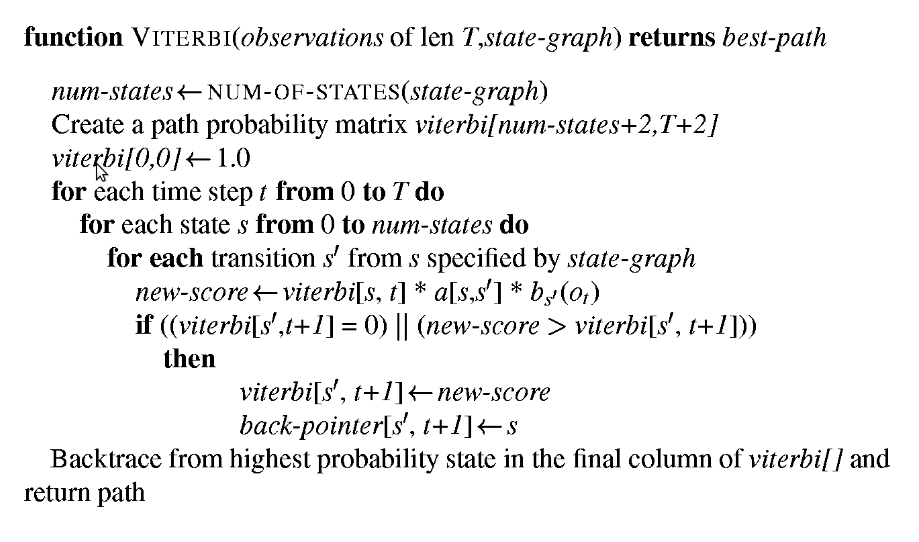

### Introduction to Viterbi Decoding for POS Tagging

Part-of-Speech (POS) tagging is a fundamental task in Natural Language Processing that involves assigning grammatical categories (noun, verb, adjective, etc.) to words in a sentence. The **Viterbi algorithm** is a dynamic programming approach that efficiently solves the decoding problem in Hidden Markov Models (HMMs) to find the most probable sequence of POS tags for a given sentence.

### Hidden Markov Models for POS Tagging

In the context of POS tagging, an HMM consists of:

- **Hidden States**: POS tags (noun, verb, adjective, etc.)
- **Observable Symbols**: Words in the sentence
- **Transition Probabilities**: P(tag_i | tag_i-1) - likelihood of transitioning from one POS tag to another
- **Emission Probabilities**: P(word | tag) - likelihood of a word being generated by a specific POS tag

### The Viterbi Algorithm

The Viterbi algorithm solves the **decoding problem**: given a sequence of words and the HMM parameters (transition and emission probabilities), find the most likely sequence of POS tags that generated those words.

### Mathematical Foundation

For a sentence with words w₁, w₂, ..., wₙ and possible tags t₁, t₂, ..., tₘ, we want to find:

**argmax P(tag_sequence | word_sequence)**

Using Bayes' theorem and the Markov assumption, this becomes:

**argmax ∏ P(word_i | tag_i) × P(tag_i | tag_i-1)**

### Dynamic Programming Approach

The Viterbi algorithm uses a table (Viterbi matrix) where:

- **Rows**: Represent possible POS tags
- **Columns**: Represent words in the sentence
- **Cells**: Store the maximum probability of any tag sequence ending at that tag for that word

### Algorithm Steps

1. **Initialization**: For the first word, compute:

   <pre>
   V[tag][1] = π[tag] × emission[tag][word₁]
   </pre>

   where π[tag] is the initial probability of the tag.

2. **Recursion**: For each subsequent word position j and each tag:

   <pre>
   V[tag][j] = max(V[prev_tag][j-1] × transition[prev_tag][tag]) × emission[tag][word_j]
   </pre>

3. **Backtracking**: Trace back through the stored path pointers to recover the optimal tag sequence.

### Example Walkthrough

Consider the sentence **"Book a park"** with tags {Noun, Verb, Det}:

**Step 1: Emission Matrix (P(word|tag))**

<pre>
         Book   a     park
Noun     0.3    0.1   0.7
Verb     0.5    0.0   0.1
Det      0.0    0.9   0.0
</pre>

**Step 2: Transition Matrix (P(tag_j|tag_i))**

<pre>
         Noun   Verb   Det
Noun     0.2    0.1    0.7
Verb     0.6    0.1    0.3
Det      0.8    0.2    0.0
</pre>

**Step 3: Viterbi Table Computation**

For "Book":

- V[Noun][1] = 0.3 (emission only, assuming uniform start)
- V[Verb][1] = 0.5
- V[Det][1] = 0.0

For "a":

- V[Noun][2] = max(0.3×0.2, 0.5×0.6, 0.0×0.8) × 0.1 = 0.03
- V[Verb][2] = max(0.3×0.1, 0.5×0.1, 0.0×0.2) × 0.0 = 0.0
- V[Det][2] = max(0.3×0.7, 0.5×0.3, 0.0×0.0) × 0.9 = 0.189

And so on for "park"...

## Computational Complexity

- **Time Complexity**: O(N × T²) where N is sentence length and T is number of tags
- **Space Complexity**: O(N × T) for the Viterbi table

Without dynamic programming, finding the optimal path would require O(T^N) time, making the Viterbi algorithm essential for practical applications.

## Applications Beyond POS Tagging

The Viterbi algorithm is widely used in:

- **Speech Recognition**: Finding most likely word sequences from acoustic signals
- **Bioinformatics**: Gene sequence analysis and protein structure prediction
- **Information Extraction**: Named entity recognition and sequence labeling
- **Machine Translation**: Alignment of word sequences between languages

## Key Insights

1. **Optimal Substructure**: The optimal solution contains optimal solutions to subproblems
2. **Markov Property**: Future states depend only on the current state, not the entire history
3. **Greedy Choice**: At each step, we choose the locally optimal solution that leads to the global optimum
4. **Memory Efficiency**: Only previous column values are needed for computation

The Viterbi algorithm elegantly balances local word-tag compatibility (emission probabilities) with global sequence coherence (transition probabilities) to find the most linguistically plausible POS tag sequence.
